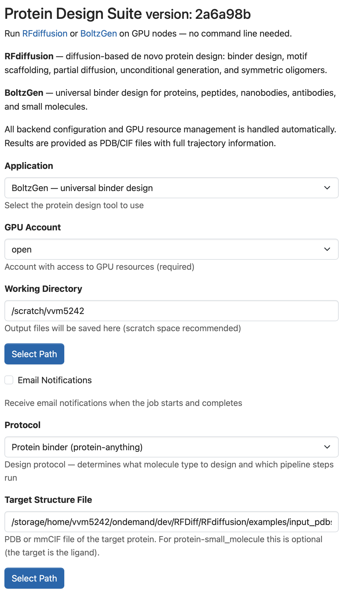
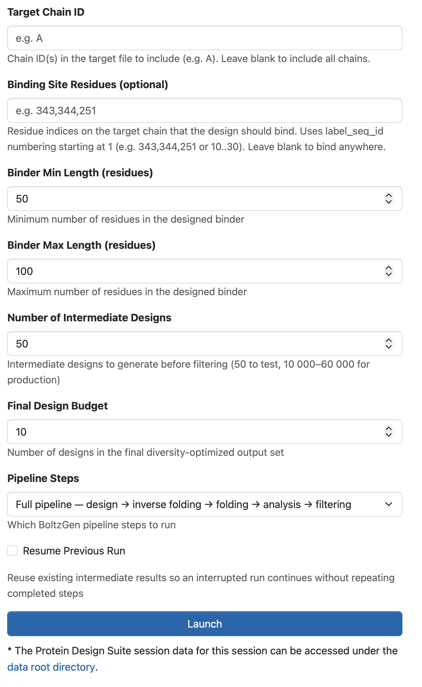
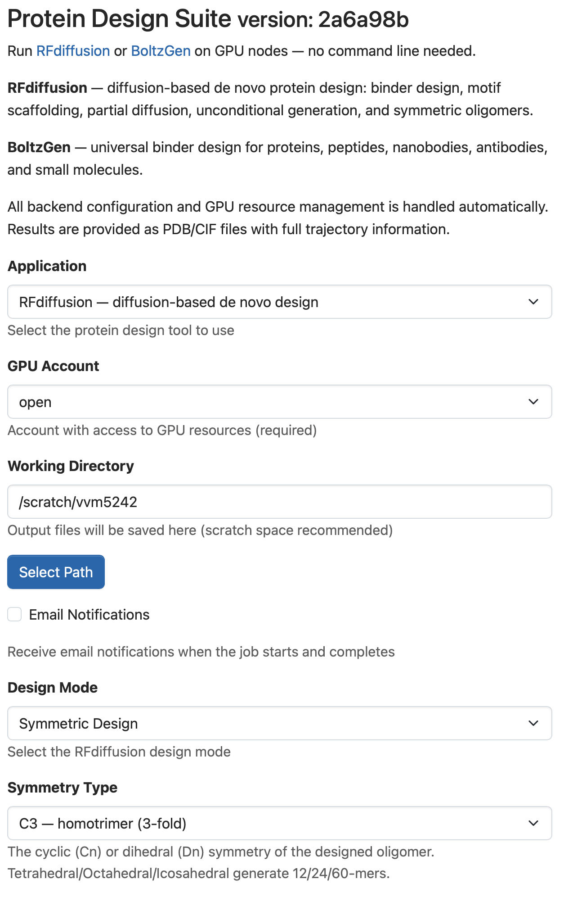
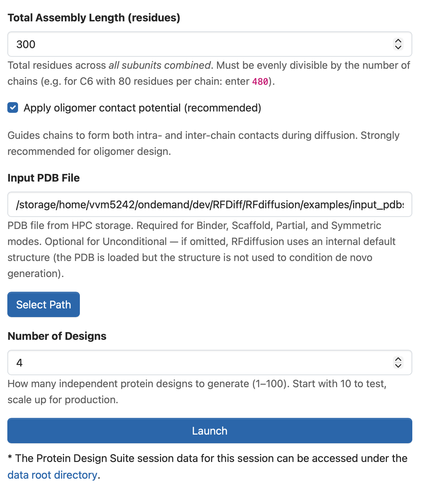
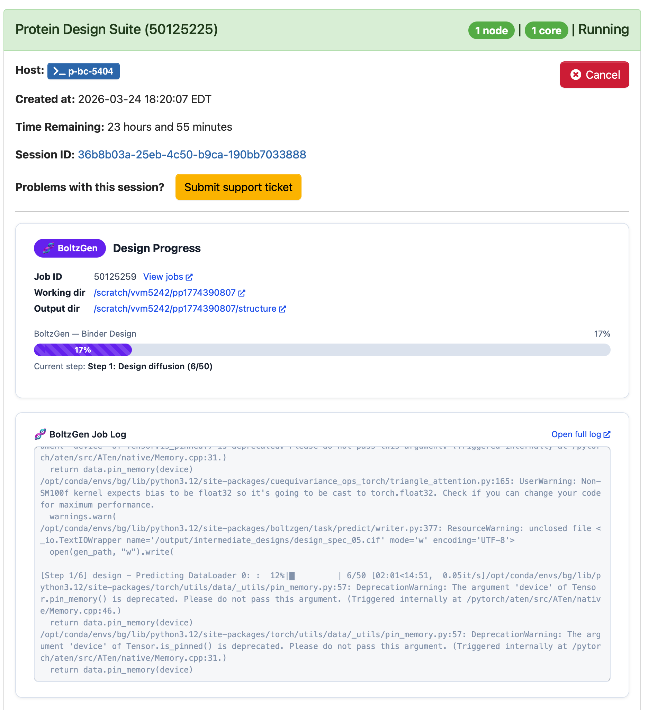
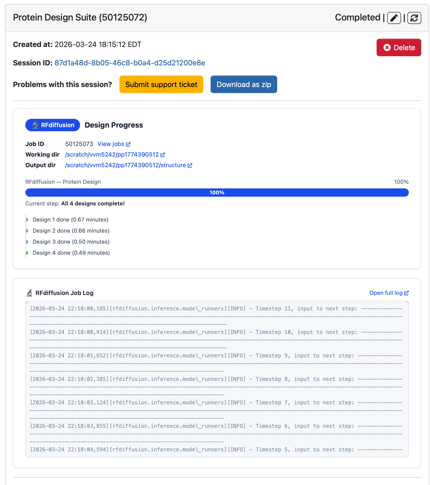

# Protein Design Suite

## Overview

An [Open OnDemand](https://openondemand.org/) Batch Connect app that provides a
web-based interface for running de novo protein design jobs on GPU nodes.
The app supports two complementary tools and handles all backend configuration,
job submission, and real-time progress monitoring automatically.

- **[RFdiffusion](https://github.com/RosettaCommons/RFdiffusion)** — diffusion-based de novo protein design (binder design, motif scaffolding, partial diffusion, unconditional generation, symmetric oligomers)
- **[BoltzGen](https://github.com/boltzmann-labs/boltzgen)** — universal binder design for proteins, peptides, nanobodies, antibodies, and small molecules

**Batch Connect template:** `basic` | **Scheduler:** Slurm | **Container runtime:** Singularity / Apptainer

---

## How It Looks

### BoltzGen input form

| BoltzGen — part 1 | BoltzGen — part 2 |
|---|---|
|  |  |

### RFdiffusion input form

| RFdiffusion — part 1 | RFdiffusion — part 2 |
|---|---|
|  |  |

### Progress during and after a run

| BoltzGen running (live log + step tracker) | RFdiffusion completed |
|---|---|
|  |  |

---

## Features

- **Unified form** — select RFdiffusion or BoltzGen from a single dropdown; irrelevant fields hide automatically
- **RFdiffusion modes:** binder design (PPI), motif scaffolding, partial diffusion, unconditional generation, symmetric oligomers
- **BoltzGen protocols:** protein-anything, peptide-anything, nanobody-anything, antibody-anything, protein→small molecule, protein redesign
- **Real-time progress bar** — startup milestones, per-design counters (RFdiffusion) and per-pipeline-step tracking (BoltzGen)
- **Live log panel** — streams the job log directly in the browser
- **Automatic GPU resource management** — GPU constraint enforced to avoid incompatible hardware
- **Results** as PDB / CIF files with full trajectory information

---

## Prerequisites

### Open OnDemand
- OOD v3 or v4 (tested on OOD v4)
- Slurm scheduler

### GPU Requirements
The containers require PyTorch ≥ sm_70. On ROAR Collab the SLURM templates already
set `#SBATCH --constraint=v100|a100` — this has been tested and works.
If your cluster uses different GPU labels, update that line in `template/boltzgen.sh`
and `template/rfdiffusion.sh`. If you need to run on older GPUs, try rebuilding the
container from the [ProteinDesign-Containers](https://github.com/EpiGenomicsCode/ProteinDesign-Containers)
definition files with a compatible PyTorch version.

### Singularity Containers and Models

Build or pull the containers using the definition files in
[ProteinDesign-Containers](https://github.com/EpiGenomicsCode/ProteinDesign-Containers):

| Image | File |
|---|---|
| `rfdiffusion_x86.sif` | `rfdiffusion/rfdiffusion_x86.def` |
| `boltzgen_x86.sif` | `boltzgen/boltzgen_x86.def` |

BoltzGen downloads model weights automatically from Hugging Face on first run and
caches them in the directory bound to `/models` inside the container.
Set `BOLTZ_MODEL_DIR` in `template/rfdiffusion_env.sh` to a persistent path with
sufficient storage (~6 GB).

---

## Installation

1. Clone this repository into your OOD dev apps directory:
   ```bash
   cd ~/ondemand/dev
   git clone https://github.com/EpiGenomicsCode/ProteinDesign-Suite RFDiff
   ```

2. Build or pull the Singularity containers (see [ProteinDesign-Containers](https://github.com/EpiGenomicsCode/ProteinDesign-Containers)).

3. Edit `template/rfdiffusion_env.sh` and set the paths for your site:
   ```bash
   CONTAINER_BASE="/path/to/your/containers"   # directory with .sif files
   BOLTZ_MODEL_DIR="${CONTAINER_BASE}/boltzgen_models"
   ```

4. Verify the app loads in your OOD dashboard under **Interactive Apps → Protein Engineering**.

---

## Configuration

### `template/rfdiffusion_env.sh`

All site-specific paths live here — this is the only file that needs editing for a
new deployment.

| Variable | Description | Default |
|---|---|---|
| `CONTAINER_BASE` | Directory containing `.sif` files | (set by admin) |
| `BOLTZ_MODEL_DIR` | BoltzGen model cache directory | `${CONTAINER_BASE}/boltzgen_models` |
| `DIFFUSION_SIF` | RFdiffusion container path | `${CONTAINER_BASE}/rfdiffusion_x86.sif` |
| `BOLTZ_SIF` | BoltzGen container path | `${CONTAINER_BASE}/boltzgen_x86.sif` |

### `form.yml.erb` — key attributes

| Attribute | Widget | Description | Default |
|---|---|---|---|
| `app_type` | select | RFdiffusion or BoltzGen | `rfdiffusion` |
| `auto_accounts` | select | GPU-capable Slurm account | (dynamic) |
| `working_directory` | path_selector | Output directory | `/scratch/<user>` |
| `design_mode` | select | RFdiffusion mode | `binder` |
| `num_designs` | number | Designs to generate | `10` |
| `boltz_protocol` | select | BoltzGen protocol | `protein-anything` |
| `boltz_num_designs` | number | BoltzGen intermediate designs | `100` |
| `boltz_budget` | number | Final filtered design count | `10` |

### `submit.yml.erb`

The wrapper job runs on the `basic` partition with the `open` account.
The actual compute job (RFdiffusion or BoltzGen) is submitted separately
inside `before.sh.erb` with GPU resources on the `standard` partition.
Update the partition and account names to match your cluster.

---

## Usage

1. Open the OOD dashboard and navigate to **Interactive Apps → Protein Engineering → Protein Design Suite**
2. Select the tool (**RFdiffusion** or **BoltzGen**)
3. Enter your GPU account and working directory
4. Fill in the tool-specific parameters:
   - **RFdiffusion:** choose design mode, provide a target PDB (required for all modes except unconditional), set length / contigs
   - **BoltzGen:** choose protocol, provide a target structure file, set binder length range and budget
5. Submit — the app launches a wrapper job that stages inputs and submits the compute job
6. Monitor progress in the OOD session panel: live step tracker, percentage bar, and streaming log

### Output structure

```
<working_directory>/
└── pp<session_id>/
    ├── input/            # Staged inputs and generated SLURM scripts
    ├── structure/        # Design outputs (PDB / CIF files)
    └── logs/             # Job logs (streamed live in the browser)
```

---

## Troubleshooting

| Symptom | Likely cause | Fix |
|---|---|---|
| "Permission denied" on mkdir | Working directory path not writable | Use `/scratch/<user>` or another writable path |
| "undefined method" on staging | Form field missing from `form.yml.erb` | Pull latest — all context fields are now declared |
| Progress bar stuck at 0% "Starting up" | Old staged `script.sh` in session | Cancel and resubmit; templates are updated |
| BoltzGen: CUDA error / no kernel image | Job landed on a P100 GPU | Ensure `--constraint=v100|a100` is in `template/boltzgen.sh` |
| RFdiffusion: FileNotFoundError for PDB | Container path mismatch | Check `inference.input_pdb` path in `template/rfdiffusion.sh` |
| BoltzGen step 4 AssertionError | Stale output dir with `--reuse` | Run without `--reuse` (default) for fresh jobs |

---

## Testing

Tested on **ICDS ROAR Collab** (Penn State) with:
- OOD v4
- Slurm
- Singularity / Apptainer
- V100 and A100 GPUs

All five RFdiffusion modes (binder, scaffold, partial, unconditional, symmetric)
and the BoltzGen protein-anything protocol have been run end-to-end through the form.

---

## Contributing

For bugs or feature requests, [open an issue](https://github.com/EpiGenomicsCode/ProteinDesign-Suite/issues).

---

## References

- [RFdiffusion](https://github.com/RosettaCommons/RFdiffusion) — Watson et al., *Nature* 2023
- [BoltzGen](https://github.com/boltzmann-labs/boltzgen) — universal binder design
- [ProteinDesign-Containers](https://github.com/EpiGenomicsCode/ProteinDesign-Containers) — Singularity definition files
- [Open OnDemand](https://openondemand.org/) — HPC portal framework
- [OOD Batch Connect app development docs](https://osc.github.io/ood-documentation/latest/app-development.html)

---

## License

MIT — see [LICENSE](LICENSE)

## Acknowledgements

Supported by Penn State Institute for Computational and Data Sciences (RRID:SCR_025154)
and Penn State University Center for Applications of Artificial Intelligence and Machine
Learning to Industry Core Facility (AIMI) (RRID:SCR_022867).

## Contact

- Technical support: vinaysmathew@psu.edu
- ICDS support: icds@psu.edu
